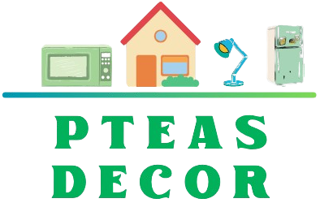

<!-- PROJECT LOGO -->
<div align="center">
  <a href="https://github.com/Kimsor1111/PteasDecor">
    
  </a>

  <h1 align="center">🏠 PteasDecor 🏠</h1>

  <p align="center">
    A modern ReactJS home decoration products e-commerce website, offering stylish and functional décor for every home.
    Built with a responsive design, intuitive navigation, and a seamless shopping experience to help customers find the perfect pieces for their living spaces.
    <br />
    <br />
    <a href="https://pteasdecor.netlify.app/">View Demo</a>
  </p>
</div>

<!-- TABLE OF CONTENTS -->
<details>
  <summary>Table of Contents 📑</summary> 
  <ol>
    <li>
      <a href="#about-the-project">About The Project</a> 📖
      <ul>
        <li><a href="#built-with">Built With 🛠️</a></li>
      </ul>
    </li>
    <li>
      <a href="#getting-started">Getting Started 🚀</a>
      <ul>
        <li><a href="#prerequisites">Prerequisites ✅</a></li>
        <li><a href="#installation">Installation 💾</a></li>
      </ul>
    </li>
    <li><a href="#folder">Folder Structure 🧑‍💻</a></li>
    <li><a href="#usage">Usage 🧑‍💻</a></li>
    <li><a href="#contributors">Contributors 🤝</a></li>
    <li><a href="#contact">Contact 📬</a></li>
    <li><a href="#acknowledgments">Acknowledgments 🙏</a></li>
  </ol>
</details>

<!-- ABOUT THE PROJECT -->
<p id="about-the-project">
</p>

## About The Project

[![Project Screenshot][project-screenshot]](https://example.com)

There are plenty of e-commerce projects out there, but I didn’t find one that perfectly fit a modern home decoration store built with ReactJS — so I created PteasDecor. This project aims to be a clean, easy-to-use template for anyone building a home décor shopping site.

Here’s why PteasDecor stands out:

- It focuses on showcasing beautiful home decoration products with a user-friendly ReactJS interface.

- It saves you time by providing a well-organized folder structure and reusable components.

- It embraces best practices like component-based architecture and responsive design 😄.

Of course, every project has its own unique needs, so I’m continuously improving PteasDecor. Feel free to contribute by forking, opening an issue, or sending a pull request. Thanks to everyone who helps make this project better!

<p id="built-with">
</p>

### Tools & Technologies

[![HTML][HTML]][HTML-url]
[![CSS][CSS]][CSS-url]
[![TailwindCSS][TailwindCSS]][TailwindCSS-url]
[![FontAwesome][FontAwesome]][FontAwesome-url]
[![JS][JS]][JS-url]
[![React][React.js]][React-url]
[![ReactRouter][ReactRouter.js]][ReactRouter-url]
[![ReactRedux][ReactRedux.js]][ReactRedux-url]

<!-- GETTING STARTED -->
<p id="getting-started">
</p>

## Getting Started 🚀

Follow these steps to set up and run the PteasDecor project on your local machine for development and testing purposes.

<p id="prerequisites">
</p>

### Prerequisites ✅

Make sure you have the following installed to run this project:

- **[Node.js](https://nodejs.org/)** (version 14 or higher recommended)
- **[npm](https://www.npmjs.com/)** (comes bundled with Node.js) or **[yarn](https://yarnpkg.com/)**
- A modern web browser (Chrome, Firefox, Edge, etc.)

<p id="installation">
</p>

### Installation 💾

1. Clone the repository

   ```sh
   git clone https://github.com/Kimsor1111/PteasDecor.git
   ```

2. Open PteasDecor Project

   ```sh
   cd PteasDecor
   ```

3. Install dependencies

   - Using npm:

     ```sh
     npm install
     ```

   - or using yarn:

     ```sh
     yarn install
     ```

4. Start the development server

   - Using npm:

     ```sh
     npm run dev
     ```

   - or using yarn:

     ```sh
     yarn start
     ```

5. Open your browser and navigate to localhost url to see the app running.

<p id="folder">
</p>

## Folders Structure 📂

### Here is PteasDecor folders structure:

```sh

├── /public                     # Static files like images, icons & _redirects

├── /src                        # Source code files

│   ├── /app                    # Redux store setup (actions, reducers, slices)

│   ├── /assets                 # Images, fonts, and other media assets

│   ├── /components             # Reusable React components or UI elements

│   ├── /data                   # Static data for whole website (Product, Footer, Navbar, ...)

│   ├── /layout                 # Layout components

│   ├── /page                   # Page-level components or views

│   └── App.jsx                 # Static route component of whole website

│   └── main.jsx                # Main application component

│

├── package.json                # Project metadata and dependencies

├── README.md                   # Project documentation

└── .gitignore                  # Files and folders to ignore in git
```

<p id="usage">
</p>

<!-- USAGE EXAMPLES -->

## Usage 🧑‍💻

Use the app to browse home decoration products, view detailed product information, add items to your cart, proceed to checkout, track orders, add products to your wishlist, and filter products by various criteria. This app is ideal for testing UI features or customizing your own online store.

<p id="contributors">
</p>

<!-- CONTRIBUTORS -->

## Contributors 🤝

Contributions are welcome! Feel free to fork the repo, create feature branches, and submit pull requests. Please open issues for bugs or feature requests.

<a href="https://github.com/Kimsor1111/PteasDecor/graphs/contributors">
  
</a>

<p id="contact">
</p>

<!-- CONTACT -->

## Contact 📬

**Ang Kimsor** - [Telegram](https://t.me/Thirtieth_October) - [angkimsor@gmail.com](mailto:angkimsor@gmail.com) - **Call Me ☎️ +855 87 932 289**

**Nak Danin** - [Telegram](https://t.me/nakdanin) - [nakdanin9@gmail.com](mailto:nakdanin9@gmail.com) - **Call Me ☎️ +855 85 201 548**

**Heng Ousa** - [Telegram](https://hengousa) - [hengousa@gmail.com](mailto:hengousa@gmail.com) - **Call Me ☎️**

Project Link: [https://github.com/Kimsor1111/PteasDecor](https://github.com/Kimsor1111/PteasDecor)

<p id="acknowledgments">
</p>

<!-- ACKNOWLEDGMENTS -->

## Acknowledgements 🙏

- Thanks to the React community for the fantastic library and support.
- Inspiration and UI ideas from various home decor websites and e-commerce templates.
- Open-source projects and tutorials that helped guide this project’s development.
- [Shields.io](https://shields.io/) for awesome badges used in this README.
- Icons from [Font Awesome](https://fontawesome.com/) and other free icon libraries.
- Images from [Alibaba](https://www.alibaba.com/) and other resources ecommerce website.
- Special thanks to friends, mentors, or contributors who provided feedback or assistance.

<!-- MARKDOWN LINKS & IMAGES -->

[project-screenshot]: src/assets/Logo/image.png
[HTML]: https://img.shields.io/badge/HTML-20232A?style=for-the-badge&logo=html5&logoColor=E34F26
[HTML-url]: https://www.w3schools.com/html/
[CSS]: https://img.shields.io/badge/CSS-20232A?style=for-the-badge&logo=css&logoColor=1572B6
[CSS-url]: https://www.w3schools.com/css/
[JS]: https://img.shields.io/badge/javascript-20232A?style=for-the-badge&logo=javascript&logoColor=F7DF1E
[JS-url]: https://www.w3schools.com/js/
[FontAwesome]: https://img.shields.io/badge/FontAwesome-20232A?style=for-the-badge&logo=font-awesome&logoColor=#538DD7
[FontAwesome-url]: https://fontawesome.com/
[TailwindCSS]: https://img.shields.io/badge/Tailwind_CSS-20232A?style=for-the-badge&logo=tailwind-css&logoColor=38B2AC
[TailwindCSS-url]: https://tailwindcss.com/
[React.js]: https://img.shields.io/badge/React-20232A?style=for-the-badge&logo=react&logoColor=61DAFB
[React-url]: https://reactjs.org/
[ReactRouter.js]: https://img.shields.io/badge/ReactRouter-20232A?style=for-the-badge&logo=react&logoColor=61DAFB
[ReactRouter-url]: https://reactrouter.com/
[ReactRedux.js]: https://img.shields.io/badge/ReactRedux-20232A?style=for-the-badge&logo=react&logoColor=61DAFB
[ReactRedux-url]: https://react-redux.js.org/
